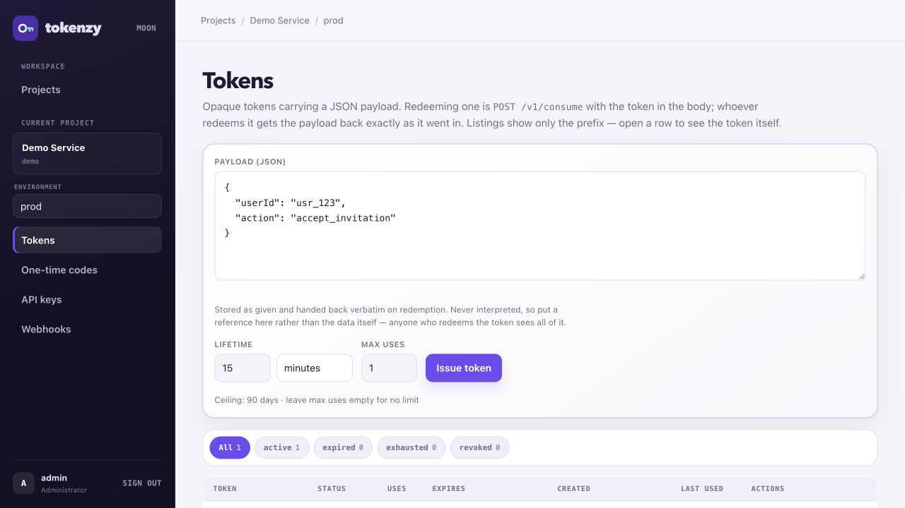
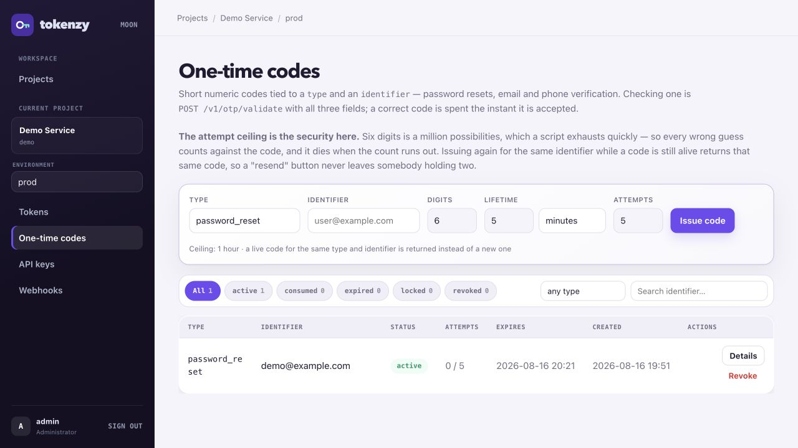
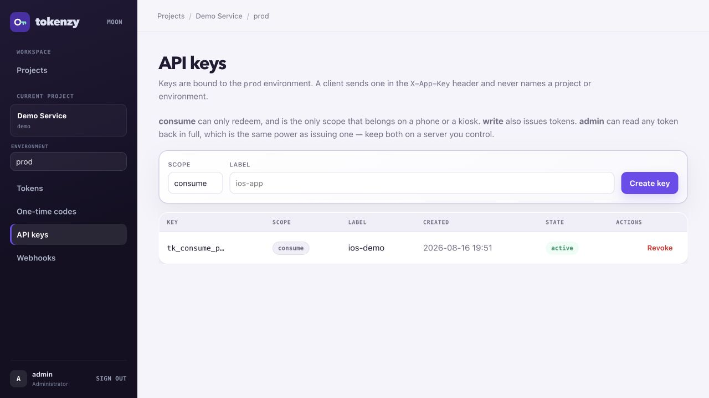

# tokenzy

Two things that expire, behind one binary:

- **Tokens** — opaque, ~244 bits, carrying a JSON payload. Issue one with a lifetime and an
  optional usage limit, redeem it once or many times, cancel it whenever you like.
- **One-time codes** — short numeric codes tied to a `type` and an `identifier`. Password
  resets, email and phone verification.

They are kept apart on purpose, because their entropy is opposite and so are their
defences: a token cannot be guessed and therefore needs no attempt counter, while a
six-digit code is a million possibilities and the attempt ceiling is the only thing making
it safe.

SQLite (WAL) storage, a JSON API, and an embedded HTMX admin panel. No CGO, so the binary
is static and cross-compiles cleanly. Nothing is fetched at runtime — HTMX, the CSS and the
templates are all compiled in.

The payload is opaque to the service. It is stored exactly as given, never parsed for
meaning, and handed back byte-for-byte on redemption. What the fields mean is your
business; tokenzy's job is to decide, correctly and exactly once, whether this token may
be spent right now.

Typical uses: magic sign-in links, invitation links, password resets, one-time download
links, event passes and QR tickets, device-pairing codes.

## Interface

<p align="center">
  
</p>

<p align="center"><sub>Token issuance and lifecycle filters</sub></p>

<p align="center">
  
  
</p>

<p align="center"><sub>One-time codes · Environment-scoped API keys</sub></p>

The embedded panel keeps token issuance, one-time codes, API keys and webhook delivery settings
scoped to the selected project and environment. Token listings expose only a prefix until an
administrator explicitly asks for the value, while lifecycle filters keep active, expired, spent
and revoked records easy to distinguish. Light and dark themes are built in.

## Contents

- [Interface](#interface) · [Build](#build) · [Run](#run) · [Configuration](#configuration-via-environment)
- [Concepts](#concepts) · [Scopes](#scopes--read-this-before-shipping-a-key)
- [Token API](#token-api) · [One-time codes](#one-time-codes)
- [Webhooks](#webhooks) · [Admin panel](#admin-panel)
- [Storage: tokens are kept in plaintext](#storage-tokens-are-kept-in-plaintext)
- [Deployment](#deployment) · [Tests](#tests)

## Build

```bash
CGO_ENABLED=0 go build -ldflags="-s -w" -o tokenzy .

# Cross-compile:
GOOS=linux GOARCH=arm64 CGO_ENABLED=0 go build -ldflags="-s -w" -o tokenzy .
```

## Run

```bash
# 1) Admin account (the password is read from the terminal, never echoed)
./tokenzy admin-create -username admin -db ./data.db

# To change it later:
./tokenzy admin-create -username admin -db ./data.db -reset

# 2) Server
./tokenzy serve -port 8080 -db ./data.db
```

Panel: <http://localhost:8080/ui/login>

`serve` flags: `-port` (default 8080), `-host` (default all interfaces), `-db` (default
`./data.db`). Migrations run automatically on every start.

### Configuration via environment

A `.env` file in the working directory is loaded at startup (`TOKENZY_ENV_FILE` overrides
the path). Real environment variables always win over the file. Start from the template:

```bash
cp .env.example .env
```

| Variable | Meaning |
|---|---|
| `TOKENZY_ADMIN_USERNAME` | 3–64 characters |
| `TOKENZY_ADMIN_PASSWORD` | at least 8 characters |
| `TOKENZY_ADMIN_PASSWORD_FILE` | read the password from a file; takes precedence over `TOKENZY_ADMIN_PASSWORD` |
| `TOKENZY_SEED_DATA` | insert the demo project. Default `1` |
| `TOKENZY_MAX_TTL` | longest lifetime a token may be given. Default `2160h` (90 days) |
| `TOKENZY_OTP_MAX_TTL` | longest lifetime a one-time code may be given. Default `1h`, hard ceiling `24h` |
| `TOKENZY_RETENTION_EXPIRED` | how long expired tokens are kept. Default `24h` |
| `TOKENZY_RETENTION_CONSUMED` | how long spent and revoked tokens are kept. Default `72h` |
| `TOKENZY_RETENTION_DELIVERIES` | how long settled webhook deliveries are kept. Default `24h` |
| `TOKENZY_RETENTION_OTP` | how long dead one-time codes are kept. Default `24h` |
| `TOKENZY_CLEANUP_INTERVAL` | how often the cleanup sweep runs. Default `10m` |
| `TOKENZY_PORT` | host port published by Docker Compose |

Durations are Go duration strings: `90s`, `15m`, `24h`, `720h`. A malformed one stops the
start rather than being ignored — these decide how long secrets live, and a typo silently
falling back to a default is not something you would notice until it mattered.

Admin bootstrap behaviour:

- If the account does **not** exist it is created (argon2id hashed; the plaintext is never
  stored).
- If it **does** exist its password is left alone — a restart must not undo a password you
  changed with `-reset`, nor resurrect one you rotated.
- Setting only one of the two, or a password that is too short, fails the start with a
  clear message.
- With neither set and no account present, a warning is logged.

## Concepts

```
Project
└── Environment  (prod is created automatically; add staging, dev, …)
    ├── Tokens
    ├── One-time codes
    ├── API keys   (consume / write / admin)
    └── Webhooks
```

Every API key is bound to exactly one environment. A client sends the key and never names
a project or environment, so a staging key cannot reach production by editing a path.

A token has two identifiers, and the difference is the point:

| | looks like | what it is |
|---|---|---|
| **token** | `tkn_` + 64 hex | the secret. Redeeming it is all it can do |
| **id** | `tok_` + 32 hex | the handle. Inspecting and cancelling work from this |

Cancelling by id is what makes "the phone with the pass on it was lost" a solvable
problem: you can kill a token you can no longer produce.

### Status

Status is never stored. It is derived from the row every time it is asked for, so it
cannot disagree with the facts:

| status | when |
|---|---|
| `revoked` | somebody cancelled it |
| `expired` | its lifetime ran out |
| `exhausted` | it was spent down to its usage limit |
| `active` | none of the above |

That order is the definition — a revoked token that has also expired reads as `revoked`,
because the interesting fact is that somebody stepped in.

**`exhausted` and `revoked` are kept apart on purpose.** Both mean the token no longer
works, but one is a pass that did its job and the other is an intervention. Collapsing
them would throw away the answer to "was this used, or did somebody cancel it?".

### A single-use token needs no revocation

Set `maxUses: 1` and the first successful redemption is what kills it. There is no second
call to make:

```
POST /v1/consume  →  valid: true,  usage {used: 1, maximum: 1, remaining: 0}
POST /v1/consume  →  valid: false, error: "invalid_token"
```

The redemption is a single atomic `UPDATE`, so the condition and the effect land together.
Simultaneous attempts on one single-use token produce exactly one success — verified by a
unit test, and by a [load test](#load-test) that threw 99,704 concurrent redemptions at a
single token and got one.

### Entropy, and why there is no rate limit

A token is `tkn_` followed by 64 hex characters — 32 bytes from two random UUIDs, about
244 bits of randomness from a cryptographic RNG. Guessing one is not a threat arithmetic
leaves on the table, so there is deliberately no attempt counter, no cooldown and no rate
limit on redemption; they would be theatre.

What *is* worth defending against is a token that leaks, and no counter helps with that.
Short lifetimes and revocation do.

## Scopes — read this before shipping a key

```
consume → POST /v1/consume, POST /v1/otp/validate
write   → consume + POST /v1/tokens, POST /v1/otp
admin   → write + /v1/manage/*
```

**A `consume` key is the only one that belongs on a phone, in a browser, or on a kiosk.**
It can spend a token it already holds and nothing else.

**`write` and `admin` keys belong on a server you control.** A `write` key mints tokens.
An `admin` key can read any token back out in full — which is the same power as minting
one, so treat it exactly like a signing key.

Issuing a one-time code is a `write` operation for a specific reason: whoever issues a code
is the party that will put it in an SMS or an email, and that is always a backend. Checking
one is `consume`, so the check can happen wherever the user typed it.

Keys are `tk_{scope}_{env}_{random}` and are stored hashed: the plaintext is shown once at
creation and never again. (Tokens and codes are different — see below.)

## Token API

Every request carries `X-App-Key: <key>`.

### Issue a token

```http
POST /v1/tokens
X-App-Key: tk_write_prod_…
```

```json
{
  "payload": { "userId": "usr_123", "action": "accept_invitation" },
  "maxUses": 1,
  "ttlSeconds": 900
}
```

```json
{
  "id": "tok_1a6365cc1d974401b332a41aa2a42274",
  "token": "tkn_628ef30895ed4f4d…",
  "expiresAt": "2026-08-16T11:29:29Z",
  "maxUses": 1
}
```

- `payload` — any valid JSON, at most 16 KiB once serialised. The limit is what keeps a
  token a *reference* to something rather than the something. Put an id here, not the
  record it points at.
- `ttlSeconds` — required, greater than 0, at most `TOKENZY_MAX_TTL` (and never more than
  the 10-year hard ceiling).
- `maxUses` — omit or `null` for no limit, otherwise at least 1.

> **Anyone who can redeem the token sees the whole payload.** It is not encrypted and not
> signed for confidentiality — it is data the service hands back on request. Never put
> anything in it that the redeemer should not read.

### Redeem a token

```http
POST /v1/consume
X-App-Key: tk_consume_prod_…
```

```json
{ "token": "tkn_628ef30895ed4f4d…" }
```

```json
{
  "valid": true,
  "payload": { "userId": "usr_123", "action": "accept_invitation" },
  "usage": { "used": 1, "maximum": 1, "remaining": 0 }
}
```

`maximum` and `remaining` are `null` for a token with no usage limit.

Every failure — unknown, mistyped, expired, already spent, revoked, or belonging to
another environment — gets the same answer, with HTTP 200:

```json
{ "valid": false, "error": "invalid_token" }
```

That is deliberate. Distinguishing the cases would help the occasional developer debugging
and help anyone probing rather more: "expired" confirms the token was real, "exhausted"
confirms somebody already used it. The panel has the real answer for whoever is entitled
to it. The status is 200 because the request was understood and answered — the *token* was
not found, and that is a fact in the body.

The token travels in the body, never in a URL. A URL is written down everywhere a request
goes: browser history, proxy access logs, the referrer of the next page. A body is written
down nowhere.

### Manage tokens (admin scope)

```http
GET    /v1/manage/tokens?status=active&limit=50&cursor=…
GET    /v1/manage/tokens/{id}
POST   /v1/manage/tokens/{id}/revoke
DELETE /v1/manage/tokens/{id}
```

**Listing** returns metadata only — id, prefix, status, usage, timestamps. No token, no
payload, structurally, not by remembering. Paging is by cursor; `nextCursor` is empty when
the listing is exhausted.

**A single token** returns everything, including the plaintext and the payload. This is
the one endpoint that does, and it is why the `admin` scope exists.

**Inspection never spends a token.** Reading a single-use token here as many times as you
like leaves it redeemable exactly once. The only thing that consumes a token is
`/v1/consume`.

**Revoke** takes effect on the very next redemption — there is no cache to wait for.
Revoking twice is not an error: you wanted it dead, and it is.

**Delete** removes the record outright. Revoking is usually better: it stops the token and
keeps the history of what it was and whether it was ever used.

### Errors

```json
{ "error": { "code": "invalid_request", "message": "'ttlSeconds' is required and must be greater than 0" } }
```

`401` missing or revoked key · `403` insufficient scope · `400` bad input · `404` unknown
id · `500` something broke. Internal errors never echo detail back — an error from the
token tables can have a token bound into it.

## One-time codes

A short numeric code addressed to a `type` and an `identifier`. The type is your own
context label (`password_reset`, `email_verify`); the identifier is whatever you address
people by — an email, a phone number, an account id. Both are opaque here: matched, never
interpreted.

### Issue, and resend

```http
POST /v1/otp
X-App-Key: tk_write_prod_…
```

```json
{
  "type": "password_reset",
  "identifier": "user@example.com",
  "ttlSeconds": 300,
  "length": 6,
  "maxAttempts": 5
}
```

```json
{
  "id": "otp_7955cc3d0f8676b4469fcb4bbbfce1ad",
  "type": "password_reset",
  "identifier": "user@example.com",
  "code": "579295",
  "expiresAt": "2026-08-16T12:44:23Z",
  "maxAttempts": 5,
  "reused": false
}
```

- `type` — required, `^[a-z0-9_]{1,64}$`.
- `identifier` — required, at most 256 characters. Trimmed and otherwise untouched: it is
  **not** lowercased, so `User@example.com` and `user@example.com` are two different
  people as far as this service knows. Normalise before you send it.
- `ttlSeconds` — required, at most `TOKENZY_OTP_MAX_TTL` (and never above 24 hours).
- `length` — 4 to 10, default 6.
- `maxAttempts` — 1 to 20, default 5. Zero is rejected rather than read as "unlimited".

**Calling it twice returns the same code.** While a code is alive for a (type, identifier)
pair, a second request hands that one back with `reused: true` and HTTP 200 instead of 201.
That is what makes a "resend" button safe: the person receives the code they already have,
rather than a second one that makes the first ambiguous.

**A resend does not extend the expiry.** If it did, pressing the button often enough would
keep one code alive forever, which is the one property a short-lived secret must not have.
Need a genuinely new one? Revoke the old by id, then issue again.

### Validate

```http
POST /v1/otp/validate
X-App-Key: tk_consume_prod_…
```

```json
{ "type": "password_reset", "identifier": "user@example.com", "code": "579295" }
```

```json
{ "valid": true, "type": "password_reset", "identifier": "user@example.com" }
```

All three fields must match. A `password_reset` code presented as `email_verify` is
refused even though the digits are right — which is what stops a code issued for one
purpose being spent on another.

A correct code is **spent the moment it is accepted**. There is no separate expiry step:
the successful validation is the expiry.

Every failure gets the same answer, with HTTP 200:

```json
{ "valid": false, "error": "invalid_code" }
```

Wrong digits, expired, already used, revoked, locked out, or no code ever issued for that
identifier — one response for all of them. Telling them apart would let somebody probing an
address learn whether a password reset is in flight for it, which is exactly the fact worth
hiding.

### The attempt ceiling is the security

Six digits is a million possibilities. A script gets through that; the only reason it does
not is that every wrong guess counts, and the code dies when the count runs out:

```
guess 1 → invalid_code   attempts 1/3, active
guess 2 → invalid_code   attempts 2/3, active
guess 3 → invalid_code   attempts 3/3, locked
correct → invalid_code   ← the right code no longer works
```

That last line is the whole point, and it is asserted in the tests. A correct guess costs
nothing: only the failing path increments, so a user who fumbles once and then gets it
right is not charged for the success.

> **Rate-limit your own "send a code" endpoint.** The ceiling protects one code, not the
> identifier. Somebody who can make your app issue codes repeatedly gets a fresh allowance
> each time, so the ceiling only bites if issuance is bounded too. tokenzy does not do that
> for you — it does not know who is asking, only which backend called it.

### Manage codes (admin scope)

```http
GET    /v1/manage/otps?status=active&type=password_reset&identifier=user@&limit=50&cursor=…
GET    /v1/manage/otps/{id}
POST   /v1/manage/otps/{id}/revoke
DELETE /v1/manage/otps/{id}
```

Listings carry no code. The single-record endpoint does, and reading it does not spend
anything — a code inspected here is exactly as usable afterwards.

### Status

| status | when |
|---|---|
| `revoked` | somebody cancelled it |
| `consumed` | it was used |
| `expired` | its lifetime ran out |
| `locked` | it ran out of attempts |
| `active` | none of the above |

### Identifiers are personal data

An identifier is usually an email address or a phone number. That shapes three things:

- Dead codes are swept after **24 hours** by default, shorter than either token window.
  Keeping a spent code is keeping somebody's contact details for nothing.
- Nothing logs an identifier. `otp.MaskIdentifier` exists for the day something wants to.
- Codes carry no webhook events, so no identifier leaves the service that way.

## Webhooks

Per environment, configured in the panel. Events:

`token.created` · `token.consumed` · `token.exhausted` · `token.revoked`

There is no `token.expired`: expiry is a condition on the clock, not a moment something
happens to the row, so there is nothing to fire from.

**The token itself is never sent.** A delivery carries the id, the prefix and the
metadata — enough to correlate against your own records, useless to an interceptor. The
token payload is included only if you tick that box, and it is off by default.

```json
{
  "id": "evt_9f1c…",
  "type": "token.consumed",
  "createdAt": "2026-08-16T11:14:29Z",
  "environment": "prod",
  "data": {
    "id": "tok_1a6365cc…",
    "tokenPrefix": "tkn_628ef308",
    "status": "exhausted",
    "usedCount": 1,
    "maxUses": 1,
    "expiresAt": "2026-08-16T11:29:29Z",
    "createdAt": "2026-08-16T11:14:29Z",
    "lastUsedAt": "2026-08-16T11:14:29Z"
  }
}
```

Each webhook can carry extra request headers of its own — an `Authorization` bearer for an
API gateway, a tenant id, a routing key — set as `Name: value` lines in the panel. They are
applied *before* tokenzy's own headers, so none of them can displace the signature, and
`Content-Type` and `X-Webhook-*` are refused at the form rather than silently ignored.

tokenzy's own headers are `X-Webhook-Id` (event id), `X-Webhook-Event`, `X-Webhook-Attempt`,
and

```
X-Webhook-Signature: sha256=<hex HMAC-SHA256 of the raw body, keyed with the webhook secret>
```

Verify against the **raw bytes** you read, before any JSON parsing — re-serialising would
change them:

```python
import hmac, hashlib
expected = "sha256=" + hmac.new(secret.encode(), raw_body, hashlib.sha256).hexdigest()
if not hmac.compare_digest(expected, request.headers["X-Webhook-Signature"]):
    abort(401)
```

Delivery is attempted immediately, then after 30s, 2m and 10m. The queue lives in the
database, so a restart mid-backoff resumes rather than dropping the delivery. Every
attempt is recorded and shown in the panel.

**Deliveries are not ordered.** Attempts run concurrently and retries arrive late, so
`token.consumed` and `token.exhausted` from one redemption can land in either order.
Ordering could not be promised once retries exist, so each delivery instead carries the
state it describes — `status`, `usedCount`, `maxUses` — and your receiver should reason
from that rather than from arrival order.

The panel's **Test** button queues a synthetic `webhook.test` delivery through the same
path as everything else, so a passing test means real deliveries will work too. Nothing in
the service produces that type otherwise, and a webhook cannot subscribe to it.

## Admin panel

Session-cookie auth, `SameSite=Lax`, argon2id password hashing. Light and dark themes.

```
/ui/login
/ui/projects
/ui/p/{slug}                        environments
/ui/p/{slug}/{env}/tokens           list, filter, issue, inspect, revoke
/ui/p/{slug}/{env}/otps             the same, plus search by type and identifier
/ui/p/{slug}/{env}/keys             create and revoke API keys
/ui/p/{slug}/{env}/webhooks         webhooks and delivery history
```

The token list shows prefixes and status only; the code list shows attempt counters and no
digits at all. Opening a row shows a **Show token** / **Show code** button — the plaintext is fetched by a separate request when you click, so
until then it is not in the page at all. Not hidden with CSS: absent.

Filter chips are real URLs, so a filtered view can be bookmarked and shared. Paging is by
cursor, which stays correct even when a whole page of tokens shares a timestamp.

The issue form takes a lifetime as a number plus a unit — seconds, minutes, hours or days —
and spells the result back out ("15 minutes — expires 16/08/2026, 15:00"). The multiplication
happens on the server, so the form works with JavaScript switched off and the ceiling is
enforced in one place; the browser only saves you a round trip. A rejected submission comes
back with everything you typed still in it.

## Storage: tokens and codes are kept in plaintext

API keys are hashed. **Tokens and one-time codes are not** — the database holds the real
values.

This is a deliberate trade. A token is often something a human carries: a link, a pass to
be printed as a QR. Being able to show it again from the panel — reprint the pass, resend
the link — is worth having, and hashing would make it impossible.

For codes the argument is stronger still: a hashed code could not be resent at all, and a
"send it again" button that produces a *different* code every time is a button that
confuses everybody who presses it.

What that buys has to be paid for, and these are not optional:

- **No log line ever contains a token.** Request logging records method, path, status and
  duration; query strings are left out for the same reason.
- **Listings carry only the prefix.** Both in the API and in the panel.
- **The full value comes from exactly one endpoint**, behind the admin scope — which is
  one endpoint precisely so that it is the one thing to audit.
- **Webhooks never carry it.** The delivery shape has no field for it.
- **The database file and every backup of it are secret material.** The file is created
  0600 and the container's `/data` is 0700, but nothing here can permission your backups.
  Do that yourself. The OTP table adds personal data to what is in there.
- **Retention is enforced, and short.** A cleanup job deletes tokens that are finished
  with, so a spent secret does not sit in the file forever. It is hygiene, not
  housekeeping — which is why the defaults are a day or three rather than weeks.

  A row goes as soon as **either** rule applies, so the windows are ceilings rather than
  guarantees: a short-lived token that was spent is deleted at `expiry + EXPIRED` without
  waiting for `CONSUMED`. What `CONSUMED` really buys you is stopping a *long*-lived token
  that has already been spent or revoked from lingering until its distant expiry date —
  a 90-day token revoked on day one goes on day four, not day ninety-seven.

  If you need a lasting record of what was used and when, write it in your own service,
  where you can keep the token **id** instead of the token.

If your threat model does not accept a readable token store, this is the wrong service —
and that is a fair conclusion to reach. It is written down here so it is a decision rather
than a surprise.

Two independent defences cover expiry, incidentally: the redemption query checks
`expires_at` itself, so an expired token cannot be spent even if the cleanup job has been
stopped for a week.

## Deployment

```bash
# Local, with a published port
cp .env.example .env
docker compose -f docker-compose.yml -f docker-compose.local.yml up -d --build

# Behind a platform proxy (Dokploy, Coolify): the main file publishes nothing
docker compose up -d --build
```

The `/data` volume is the whole service's state. Without it, a redeploy starts from an
empty database and **every token ever issued stops working** — so the startup log says, on
every boot, whether it found an existing database or is creating a new one. Silence there
would make a lost volume look exactly like a healthy first install.

Set `TOKENZY_SEED_DATA=0` on a real deployment for the same reason: an empty panel tells
you straight away that something went wrong.

## Tests

```bash
go test ./...
go test -race ./...
```

Covering, among other things:

- 50 goroutines racing one single-use token — exactly one wins, and the row records one use
- a spent token being rejected on the second attempt, as `exhausted` rather than `revoked`
- every failure mode of redemption returning a byte-identical response
- the full scope matrix, including a `consume` key being refused a token read-back
- inspection not consuming a single-use token, however many times it is repeated
- listings and webhook deliveries containing no plaintext token, checked against the bytes
- cursor paging visiting every token exactly once
- webhook signatures verifying, retries being scheduled, and delivered events not re-sent
- a resend returning the same code without extending its expiry
- the attempt ceiling locking a code, after which the **correct** code is refused too
- a code being refused for the right digits under the wrong `type`
- 50 concurrent validations of one correct code producing exactly one success
- 20 concurrent issuances for one identifier producing exactly one code
- generated codes keeping their leading zeros
- custom webhook headers reaching the receiver without being able to displace the signature
- lifetime units converting exactly, and "9999999999999999 days" being refused rather than
  overflowing into a token that never expires

### Indexes

`internal/db/plan_test.go` pins the access path of every query whose cost grows
with the size of a table, so an index that stops being used fails the build rather
than quietly making the service slower.

The indexes were chosen by measuring, and the measurements overruled the query
plans more than once. Against 200k tokens and 500k webhook deliveries:

| | before | after |
|---|---|---|
| panel status counts | 70ms | **30ms** |
| delivery cleanup sweep (holds the write connection) | 15ms | **0.0ms** |
| token listing, first page | 0.01ms | 0.01ms |

The status counts got faster with no index at all — four `COUNT` queries over the
same rows became one pass. A covering index does take them to ~17ms, but it has to
include `used_count`, which changes on every redemption; it more than doubled the
cost of consuming a token, which is a bad trade for 13ms on a page a human loads by
hand.

Two cleanup queries still scan their table on purpose. Indexes that removed the
scans measured *slower*, because a `LIMIT`ed linear pass beats a union of two index
scans here. `TestKnownTableScans` asserts they still scan, so that changing it means
reading why and measuring again.

### Load test

[k6](https://k6.io) workloads, each against its own fresh database:

```bash
./loadtest/run.sh              # all workloads
VUS=100 DURATION=60s ./loadtest/run.sh
```

`mint`, `consume`, `reuse`, `manage` and `mixed` measure throughput. **`contend` does not** —
it points every VU at a single `maxUses: 1` token for the whole run and asserts that exactly
one request in the entire test succeeded. On a laptop that is a hundred thousand concurrent
attempts producing one redemption:

```
tokens_accepted: count=1
tokens_rejected: count=99703
PASS: exactly 1 redemption succeeded out of 99704 attempts
```

The databases it creates hold real plaintext tokens. They land in the gitignored output
directory — delete it when you are done.
